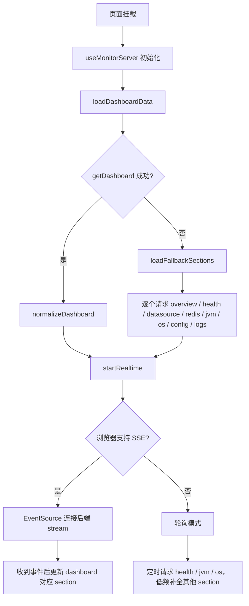

# Monitor Server Composables 快速上手

这组 composables 负责“服务器监控页”的数据获取、结构归一化和实时刷新。页面入口仍然保持轻量，核心逻辑被拆成了几个职责明确的模块，便于维护和扩展。

## 一、文件分工

### 1. 入口编排

- [useMonitorServer.ts](../../src/pages/super-admin/monitor/server/composables/useMonitorServer.ts)
- [useMonitorServer.template.js](../../src/pages/super-admin/monitor/server/composables/useMonitorServer.template.js)

它们是页面真正调用的 hook 入口。当前模板文件只是转发到 TypeScript 实现，避免页面还要关心拆分后的内部结构。

### 2. 接口访问

- [useMonitorApi.ts](../../src/pages/super-admin/monitor/server/composables/api/useMonitorApi.ts)

负责统一调用后端监控接口：先尝试全量仪表盘接口，失败后再降级为分段请求。

### 3. 实时刷新

- [useRealtimeMonitor.ts](../../src/pages/super-admin/monitor/server/composables/realtime/useRealtimeMonitor.ts)

负责 SSE 连接、断线重连、以及 SSE 不可用时的轮询兜底。

### 4. 数据归一化

- [dashboardModel.ts](../../src/pages/super-admin/monitor/server/composables/models/dashboardModel.ts)
- [configModel.ts](../../src/pages/super-admin/monitor/server/composables/models/configModel.ts)
- [jvmModel.ts](../../src/pages/super-admin/monitor/server/composables/models/jvmModel.ts)
- [types.ts](../../src/pages/super-admin/monitor/server/composables/models/types.ts)

这些模块把后端原始 payload 转成页面稳定消费的结构，减少页面层的判断分支。

当前实现严格以 [docs/basic/api-call.md](../basic/api-call.md) 里的响应体为准，只读取文档明确写出的字段，不再猜测 `serviceName`、`hostname` 之类的别名。

### 5. 通用工具

- [formatters.ts](../../src/pages/super-admin/monitor/server/composables/utils/formatters.ts)
- [normalizers.ts](../../src/pages/super-admin/monitor/server/composables/utils/normalizers.ts)
- [pickers.ts](../../src/pages/super-admin/monitor/server/composables/utils/pickers.ts)

负责格式化时间、字节、运行时长，以及挑选字段、标准化状态值。

## 二、整体运行流程

简化理解：

1. 页面先拿一次完整仪表盘。
2. 如果完整接口失败，就退回到分段接口。
3. 数据一旦写入 `dashboard`，页面就只消费这个响应式对象。
4. 后续实时更新优先走 SSE，不行就轮询。

## 三、各模块的职责

### `useMonitorServer`

这是页面真正使用的 orchestrator，职责只有三件：

1. 组织首次加载。
2. 维护页面展示状态，例如 `dashboard`、`lastRefreshText`、`statusMeta`、`connectionMeta`。
3. 组装给页面直接消费的计算属性，例如 `summaryCards`、`healthItems`、`resourceItems`、`jvmItems`。

它不直接访问所有接口细节，而是把取数委托给 `useMonitorApi` 和 `useRealtimeMonitor`。

### `useMonitorApi`

它做的是“取数”，不负责展示逻辑。

运行顺序如下：

1. 调 `monitorApi.getDashboard()`。
2. 成功则把 payload 交给 `applySection('dashboard', ...)`。
3. 失败则按 section 逐个拉取：`overview`、`health`、`datasource`、`redis`、`jvm`、`os`、`config`、`logs`。
4. 每个分段接口都通过 `unwrapApiPayload` 解包后，再交给统一的 section 更新函数。

### `useRealtimeMonitor`

它管理实时通道，核心逻辑是三层兜底：

1. 优先 SSE。
2. SSE 失败后短暂重连。
3. 多次失败后切换为轮询。

当收到 SSE 事件时，会把事件名当成 section 名，再把事件数据交给 `applySection` 更新 dashboard 的对应部分。

### `dashboardModel`

这个模块负责把后端返回的数据变成统一的页面状态。

它按文档中的结构直连这些 section：`generatedAt`、`overview`、`health`、`datasource`、`redis`、`jvm`、`os`、`config`、`logs`。

它做了几件事：

1. 提供一份本地 mock 数据，保证页面有默认值。
2. 把完整仪表盘 payload 转成页面结构。
3. 对 overview、health、数据库、Redis、JVM、OS、配置、日志分别做归一化。

`normalizeDashboard` 是全量落盘的入口，适合首次加载或 dashboard 事件覆盖更新。

### `configModel` / `jvmModel`

这两个模块适合单独理解：

1. `normalizeConfigList`：把配置类 payload 转成 `{ label, value }[]`。
2. `normalizeLogList`：把日志类 payload 转成 `{ time, level, content }[]`。
3. `normalizeJvmPayload`：提取堆内存和线程数，输出稳定的 JVM 状态对象。

## 四、数据更新策略

页面里对 `dashboard` 的更新分两种：

### 1. 全量更新

适用于 `dashboard` 接口或首次加载成功后的整包覆盖。

做法：

1. 调 `normalizeDashboard(raw)`。
2. 直接替换整个 `dashboard.value`。

### 2. 增量更新

适用于 SSE 事件或单个分段接口返回。

做法：

1. 根据 section 找到对应的 apply 函数。
2. 只更新 dashboard 中对应字段。
3. 其余字段保持不变。

这意味着页面不会因为一块数据刷新而丢掉其他区域的状态。

## 五、常见状态含义

### `statusMeta`

根据整体健康状态决定展示：

1. `UP` -> 正常。
2. `WARN` -> 注意。
3. `DOWN` -> 告警。

### `connectionMeta`

根据实时连接模式决定展示：

1. `sse` -> SSE 实时刷新。
2. `polling` -> 轮询兜底。
3. `reconnecting` -> SSE 重连中。
4. `fallback` -> 轮询兜底中。
5. 其它 -> 正在建立 SSE 连接。

### `transportText`

告诉页面当前数据来自哪里：

1. 本地示例数据。
2. 后端接口加载结果。
3. 已连接后端监控接口。
4. 后端接口轮询刷新。

## 六、页面上手顺序

如果你要继续扩展这个页面，推荐按这个顺序理解：

1. 先看 [useMonitorServer.ts](../../src/pages/super-admin/monitor/server/composables/useMonitorServer.ts) 的返回值，知道页面可直接消费什么。
2. 再看 [useMonitorApi.ts](../../src/pages/super-admin/monitor/server/composables/api/useMonitorApi.ts) 的分段请求和 fallback 逻辑。
3. 再看 [useRealtimeMonitor.ts](../../src/pages/super-admin/monitor/server/composables/realtime/useRealtimeMonitor.ts) 的 SSE / polling 兜底。
4. 最后看 [dashboardModel.ts](../../src/pages/super-admin/monitor/server/composables/models/dashboardModel.ts) 的归一化逻辑。

这样最容易建立起“页面状态 -> 数据来源 -> 实时更新”的完整心智模型。

## 七、扩展建议

如果后端以后新增监控 section，建议按这个流程接入：

1. 先在 `MonitorSection` 里补枚举。
2. 在 `useMonitorApi` 里补请求映射。
3. 在 `useRealtimeMonitor` 的事件列表里补事件名。
4. 在 `useMonitorServer` 里补对应的 `applyXxxPayload`。
5. 在 `dashboardModel` 里补全量归一化逻辑。

这样可以保证全量加载、SSE 和轮询三条路径都一致。
